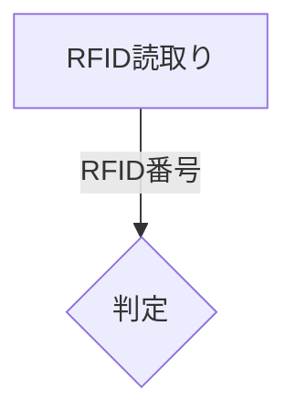

# 07_02_flowchart生成仕様

## 1. 本書の目的

本書は、Mermaid flowchart生成仕様を定義する。
flowchartはFlowVersionのNodeとLinkを中心に、処理の流れを視覚化するために使用する。

## 2. 入力データ

- Flow
- FlowVersion
- Lane
- Stage
- Node
- Link
- Comment

## 3. 基本構文

## 4. 方向

初期はTDを標準とする。
将来、LR出力をオプションで選択可能とする。

## 5. Node変換

NodeTypeごとにMermaid記法へ変換する。
開始・終了・処理・判定を優先対応とする。

## 6. Link変換

Linkは `FROM -->|ラベル| TO` として出力する。
ラベルにはデータ名、通信種別、条件を含める。

## 7. subgraph

LaneまたはStageをsubgraphとして表現できる。
初期はLane優先でsubgraph化する。

## 8. コメント

通常コメントはMermaidコメントまたは補足ノードとして出力する。
AI専用メモは出力オプションで含有可否を制御する。

## 9. エラー処理

Nodeが存在しないLinkは出力不可とし、エラーとして返す。

## 10. テスト観点

- NodeがMermaidノードへ変換されること
- Link方向が保持されること
- 判定Nodeが判定記法になること
- subgraphを生成できること

## 11. 完了条件

FlowVersionからflowchartとして有効なMermaid文字列を生成できること。
