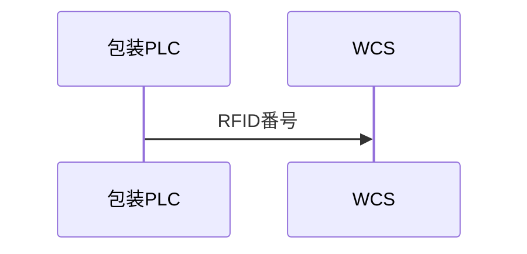

# 07_03_sequenceDiagram生成仕様

## 1. 本書の目的

Mermaid sequenceDiagram生成仕様を定義する。
sequenceDiagramはLane間の通信、要求、応答、通知を時系列で表現するために使用する。

## 2. 入力データ

- Lane
- Stage
- Node
- Link

## 3. 基本構文

## 4. participant変換

Laneをparticipantへ変換する。
participant IDは安定したMermaid識別子を生成し、表示名はLane名を使用する。

## 5. メッセージ変換

LinkのFROM NodeのLaneからTO NodeのLaneへメッセージを生成する。
ラベルにはdataName、communicationType、conditionTextを含める。

## 6. 自己通信

同一Lane内のLinkは自己メッセージとして出力する。

## 7. Stage表現

StageはNoteまたは区切りコメントとして表現する。
厳密な工程レーン表現はflowchartを優先する。

## 8. 条件表現

条件付きLinkはメッセージラベル内に条件を出力する。

## 9. テスト観点

- Laneがparticipantになること
- Linkが通信メッセージになること
- 同一Lane内通信を表現できること
- 条件付きLinkが欠落しないこと

## 10. 完了条件

FlowVersionからsequenceDiagramとして有効なMermaid文字列を生成できること。
