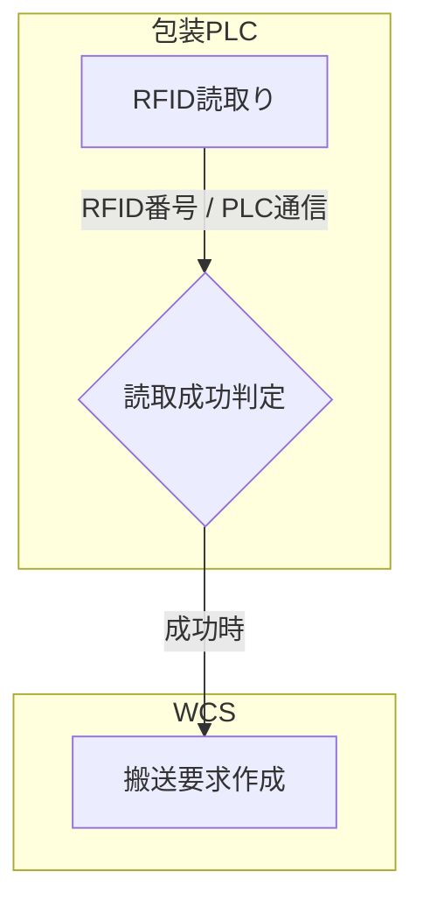
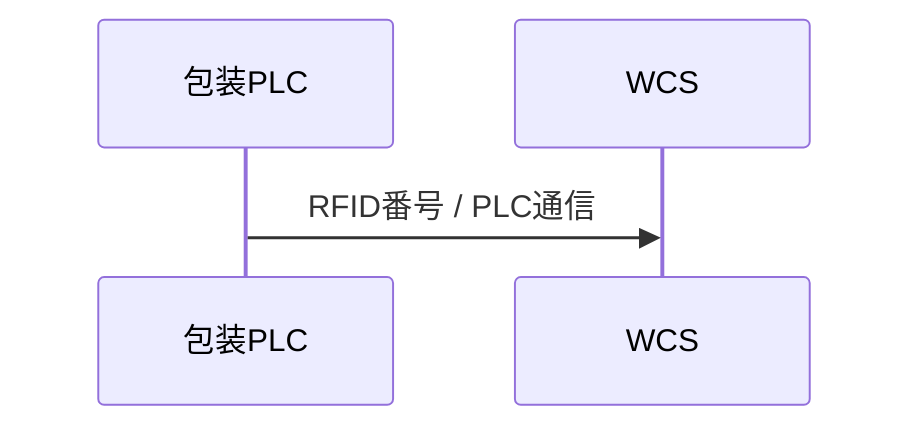
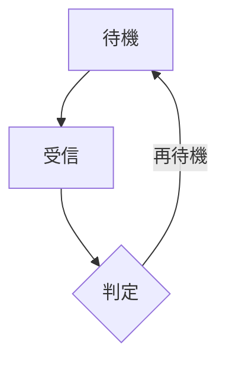

# 07_19_サンプル出力

## 1. 本書の目的

Mermaid出力のサンプルを定義する。
実装者が生成結果のイメージを確認できるようにする。

## 2. flowchartサンプル



## 3. sequenceDiagramサンプル



## 4. コメントサンプル

```mermaid
%% RFIDリーダ機種依存あり
N_n_001[RFID読取り]
```

## 5. ループサンプル



## 6. テスト観点

- サンプルがMermaidとして表示できること
- Node IDと表示名が分離されていること
- Linkラベルにデータ名が含まれること

## 7. 完了条件

サンプルを基準に実装結果を確認できること。
